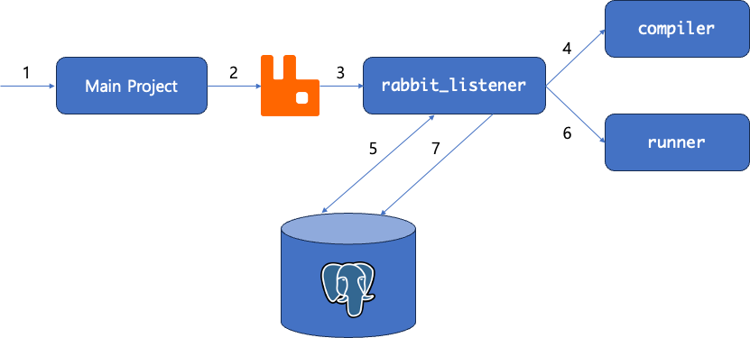

# Java Code Runner

Compile and run Java code with [Python Subprocess](https://docs.python.org/3/library/subprocess.html).
This project will act as a worker for another project, basically to create a service like 
[Leetcode](https://leetcode.com/) or [Hackerrank](https://www.hackerrank.com/)...a poor man's version at least. 

Meant to be run as a docker container to prevent any harsh actions to the host server.
More security measurements needed.

## Middlewares

- Postgresql: The Database...obviously
- RabbitMQ: Listens to incoming code run requests

All run on Docker with compose
 
## Dependencies

- SQLAlchemy: ORM Framework
- psycopg: Python Postgresql Driver
- Pika: AMQP 0-9-1 protocol implementation
  
## Interests

Recently participated projects was focused on what is right...or popular, to be precise. 
Which was a very stressful work environment.
So using python, I wanted to try out tools I wasn't familiar with, 
without much reference from blogs, tutorials, but only documentations.
Since most of my python experience was algorithms and Django, it was a joyful experience.

## Basic Concept

1. a User submits a solution from a higher project.
2. the project produces a message containing JSON data that looks like [example_payload.json](example_payload.json).
   - A computer may produce this message easily...
   - But for humans [`dict_to_json.py`](dict_to_json.py) may come in handy
3. [`rabbit_listener.py`](rabbit_listener.py) listens to the message, and save the code to a file.
   - So this project is meant to be run as multiple instances, for the competing consumers pattern.
4. [`compiler.py`](compiler.py) compiles the code.
5. [`rabbit_listener.py`](rabbit_listener.py) retrieves test cases with [`repository.py`](repository.py),
6. then use [`runner.py`](runner.py) to run the code once per test case.
7. finally, compare the output with expected, and update the results!

In between database transactions database omitted (status change, etc.).

## TODO

- [ ] Dockerfile
- [ ] Configuration management
- [ ] GitHub Actions
- [ ] Set run restrictions (timeout, memory)
- [ ] Run multiple test cases at once
- [ ] Find more security vulnerabilities
- [ ] Clean up files
